# Diagram — Sistem Informasi PKK Kabupaten Toba

> Semua diagram di bawah memakai **Mermaid** dan bisa dirender langsung di
> GitHub/GitLab dan VS Code (extension Markdown Preview Mermaid Support).
> Konteks lengkap: [`arsitektur.md`](arsitektur.md) dan [`proses-bisnis.md`](proses-bisnis.md).

---

## 1. Diagram Konteks Sistem

Satu codebase Laravel melayani Landing Page + Admin Panel dan SIDONGAN,
terhubung ke dua database dan aplikasi SIEDA.

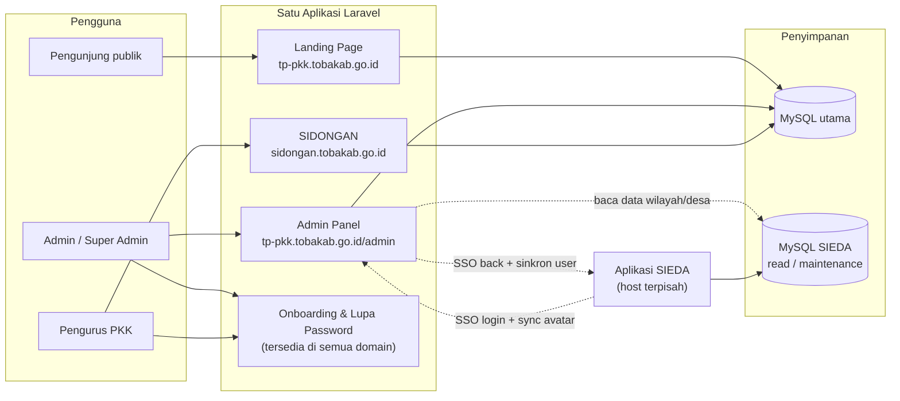

---

## 2. Arsitektur Internal (Lapisan)

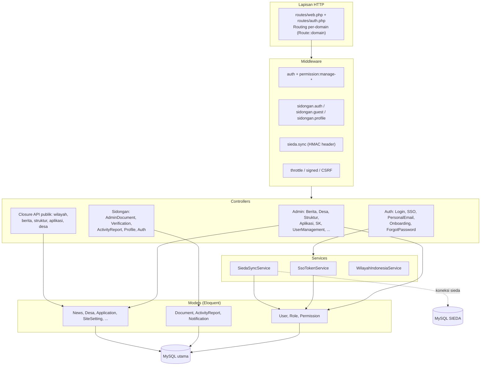

---

## 3. Diagram Penyebaran (Deployment)

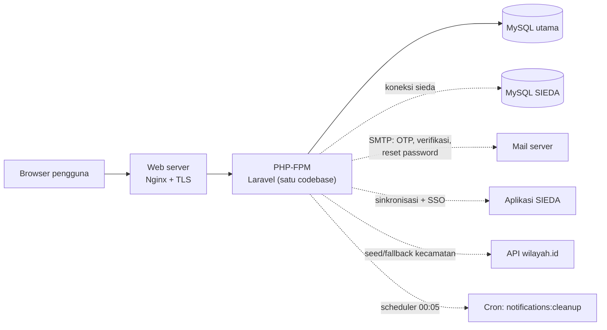

---

## 4. ERD — Database Utama (subset penting)

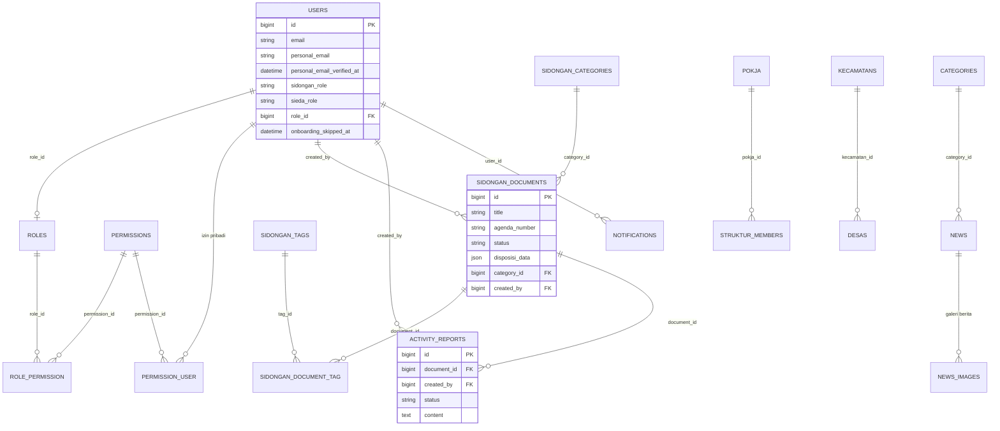

> Tabel `sidongan_documents`, `sidongan_categories`, `sidongan_tags`,
> `sidongan_document_tag`, dan `activity_reports` menjadi inti aplikasi
> SIDONGAN; sisanya melayani Admin Panel dan landing page.

---

## 5. ERD — Database SIEDA (ringkas, koneksi `sieda`)

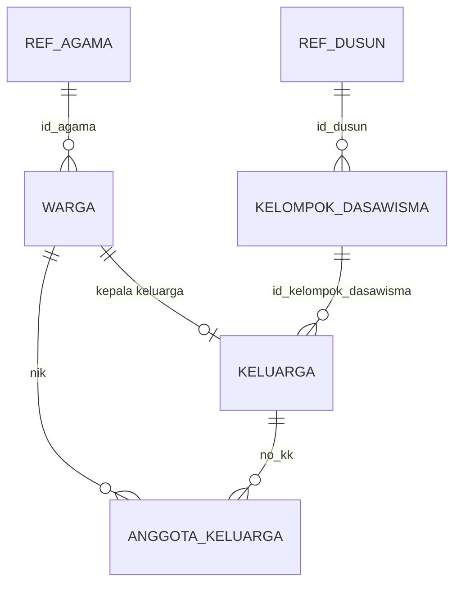

> Database ini diakses terbatas (data desa untuk modul Desa, pemeliharaan
> oleh Super Admin). Admin Panel tidak pernah menulis data milik SIEDA
> kecuali lewat endpoint yang disepakati.

---

## 6. Alur Autentikasi & SSO (PB-01)

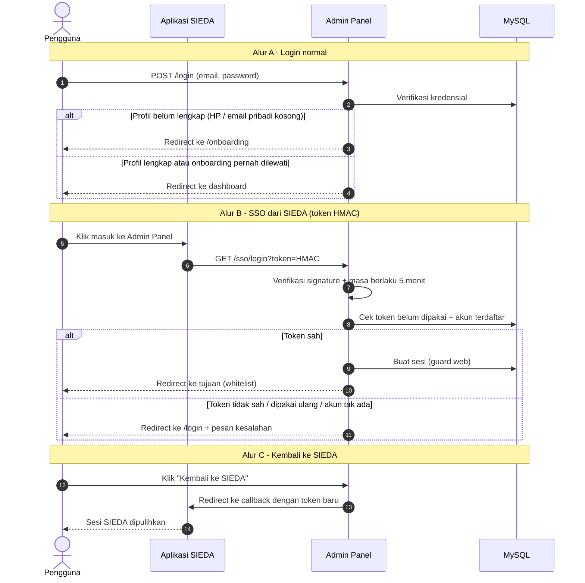

---

## 7. Alur Onboarding & Verifikasi Email Pribadi (PB-02)

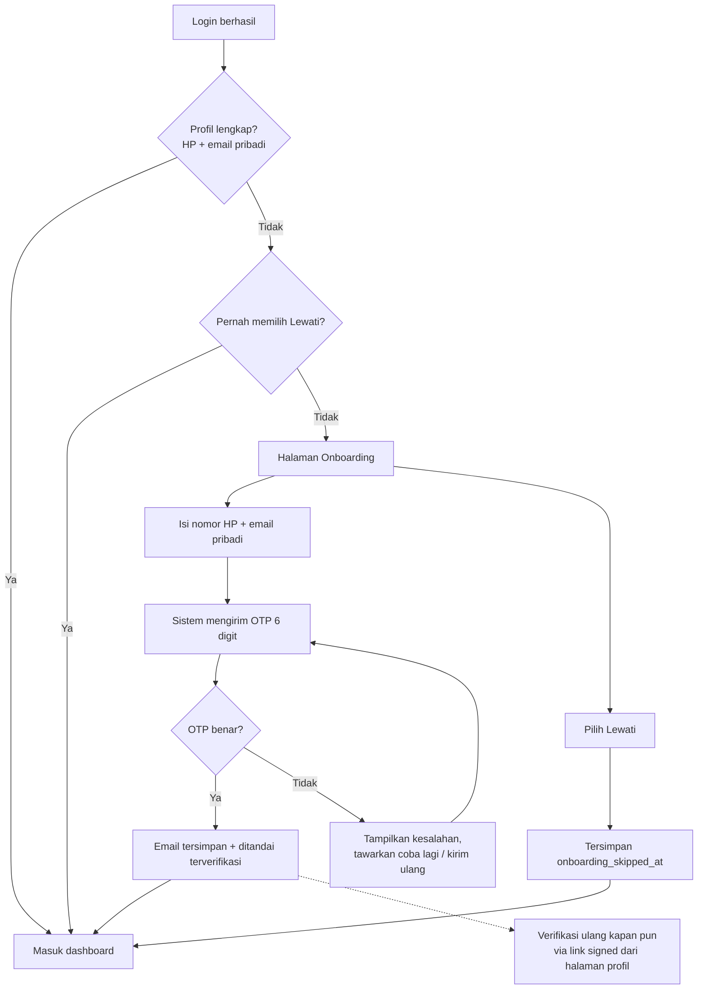

> Mengganti email pribadi akan **mereset** status verifikasi dan mengirim
> verifikasi baru ke alamat yang diubah.

---

## 8. Alur Lupa Password Terpadu (PB-03)

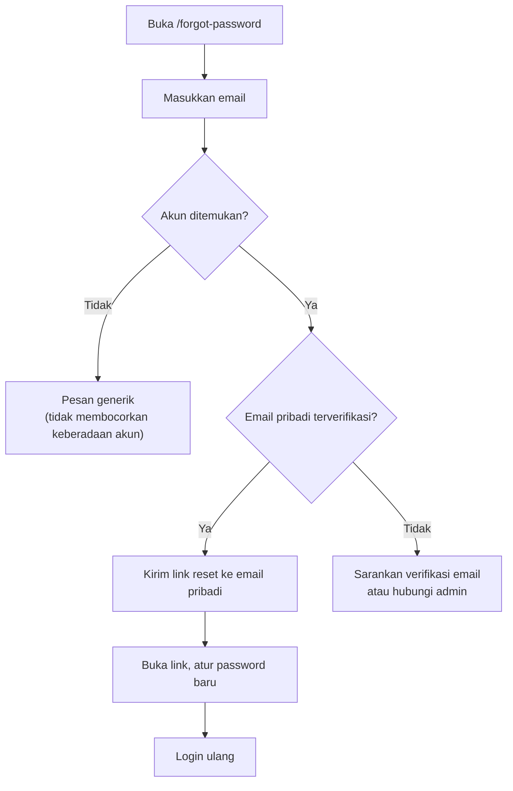

---

## 9. Alur Siklus Surat SIDONGAN (PB-06 s.d. PB-10)

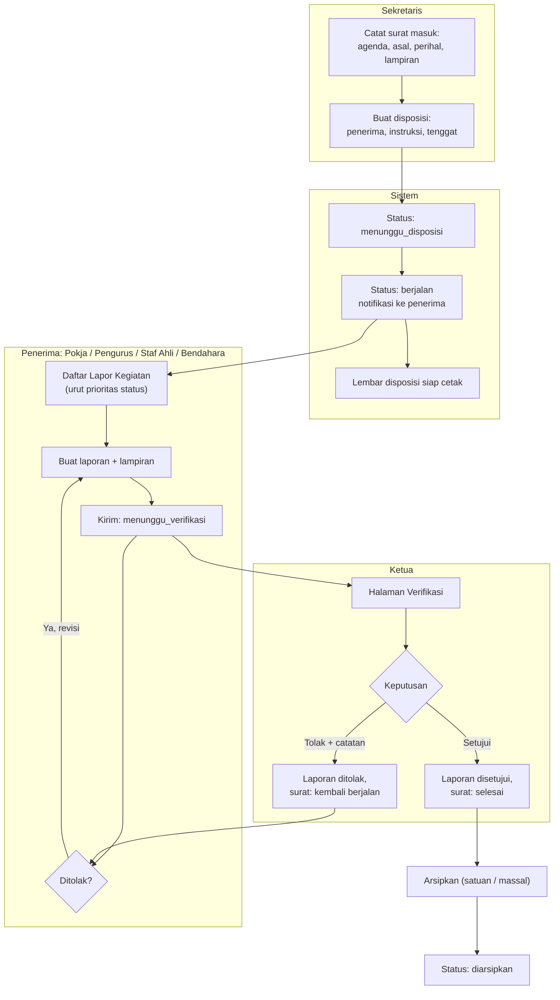

### Status surat (state machine)

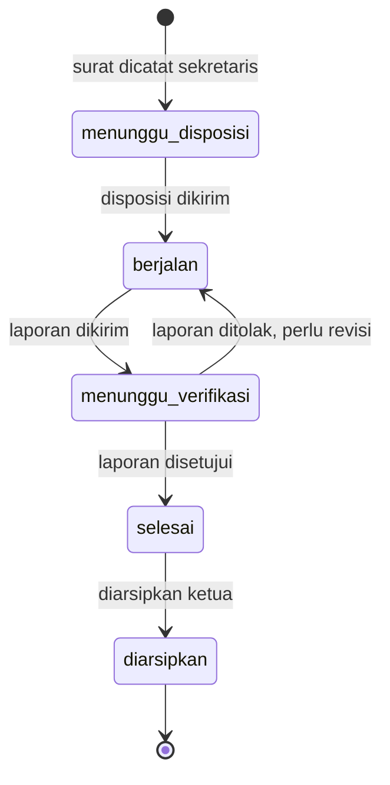

### Status laporan kegiatan (state machine)

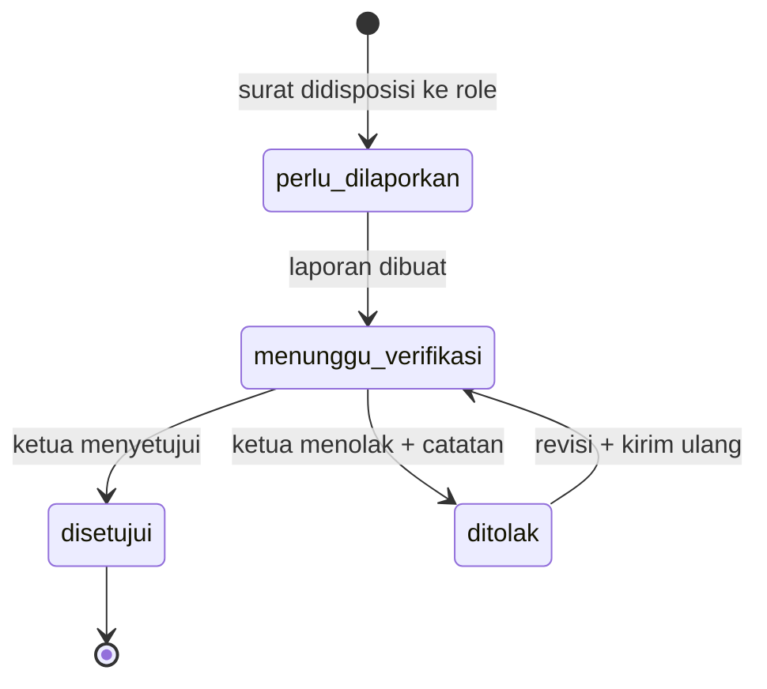

> Status surat **dihitung otomatis** dari laporan terakhirnya (tidak di-update
> manual), sehingga daftar, statistik, dan detail selalu konsisten.

---

## 10. Arsitektur Terpadu PKK Toba, SIEDA Web, dan SIEDA Mobile

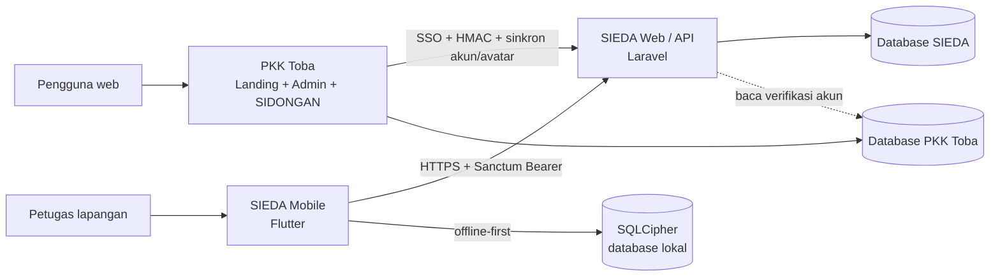

## 11. Alur SIEDA Mobile Offline-First

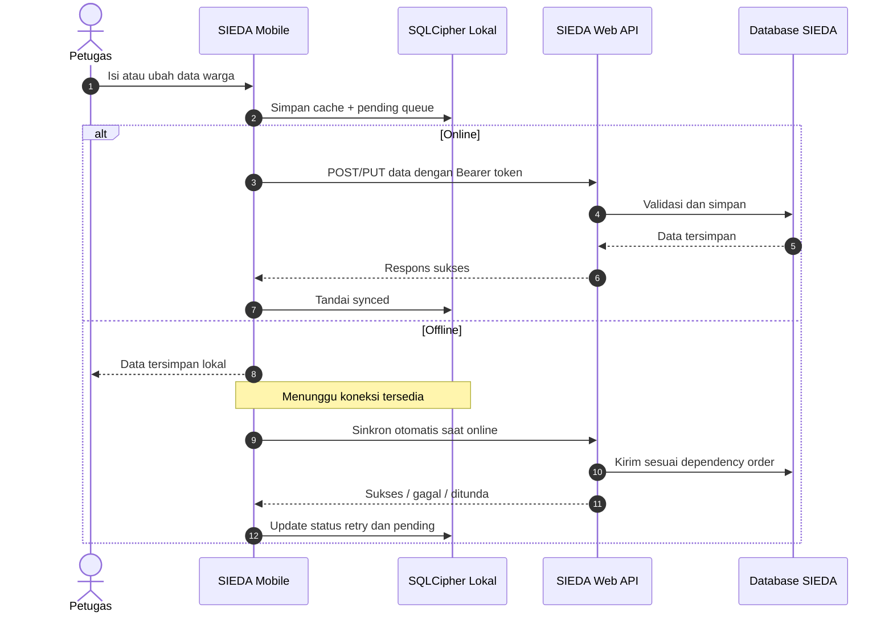

## 12. Alur Data Mobile dan Dependency Ordering

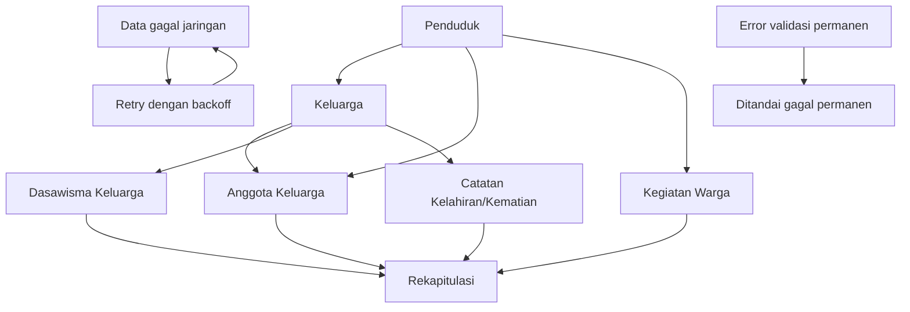

## 13. Alur Sinkronisasi dengan SIEDA (PB-12)

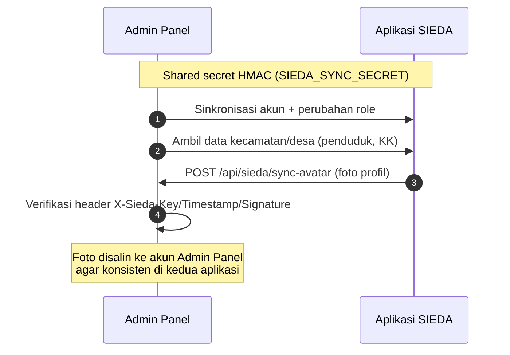
